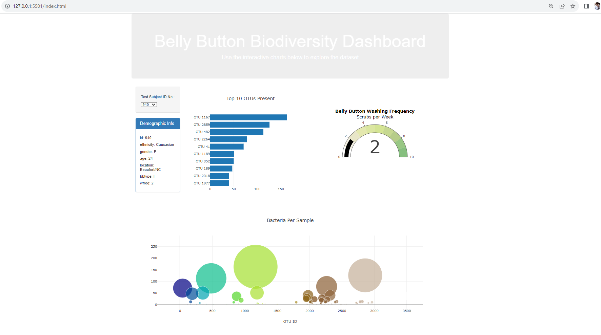
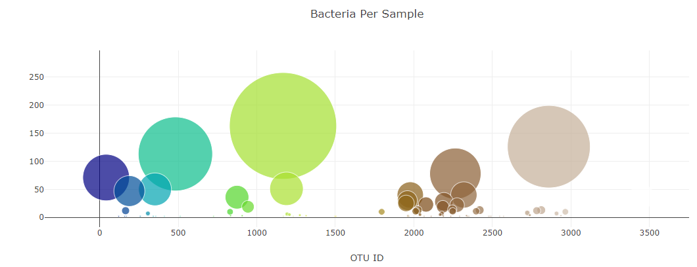
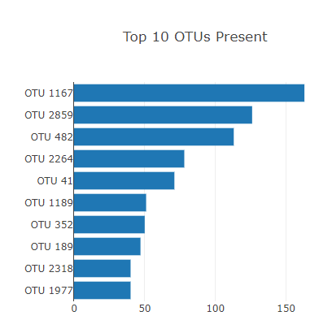
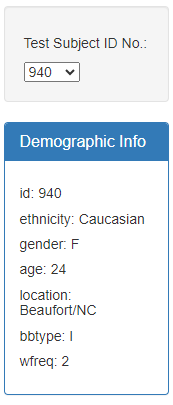
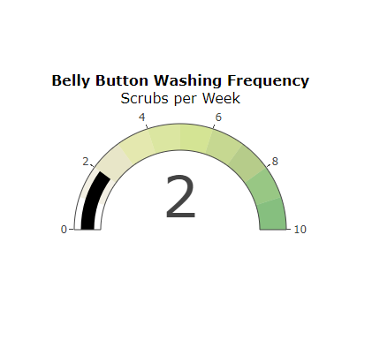

# belly-button-challenge
Week 14 java script visualisation
 

github - https://github.com/Sharad-bootcamp/belly-button-challenge.git
support and help: class activities slack, ask your classmates, 
slackoverflow
